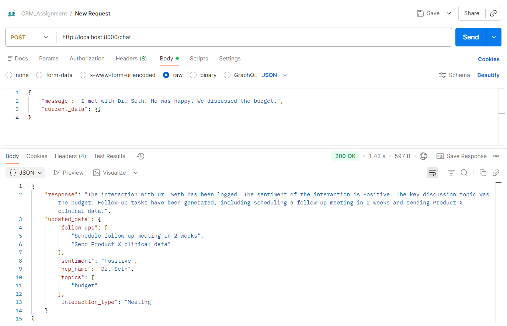
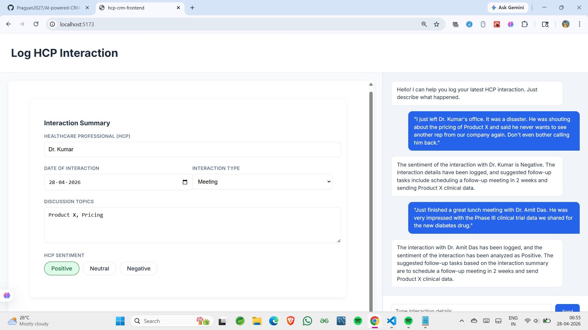
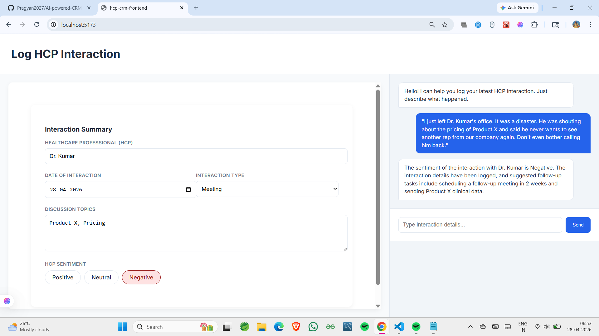

# AI-Powered HCP Interaction CRM Module

An enterprise-grade **Life Sciences CRM module** designed to streamline the logging of Healthcare Professional (HCP) interactions.

This project demonstrates an **AI-first architecture**, where field representatives can log complex interactions via a conversational chat interface. The system intelligently processes the input and automatically populates a structured compliance form in real time.

---

## Key Features

### 1. Conversational Logging

Log HCP interactions using natural language. The system processes user input via **Llama 3.3 (70B) on Groq** to extract structured insights.

### 2. Intelligent Auto-Fill

Automatically extracts:

* HCP Name
* Interaction Topics
* Sentiment
* Follow-up actions

and fills the form dynamically.

### 3. Agentic Orchestration

A **LangGraph-powered multi-agent system** that manages:

* Logging interactions
* Editing records
* Fetching history
* Generating follow-ups

### 4. Dynamic Sentiment Analysis

Automatically detects sentiment:

* Positive
* Neutral
* Negative

to enable data-driven decision-making.

### 5. State Synchronization

Built using **React + Redux Toolkit** ensuring:

* Single source of truth
* Real-time UI updates
* AI + user input consistency

### 6. Medical-Grade UI

* Clean card-based layout
* Google Inter font
* Healthcare-focused color scheme

---

##  Architecture & Tech Stack

### 1. Backend (AI Orchestration & APIs)

* **Framework:** FastAPI (Python)
* **LLM:** Llama 3.3 70B (via Groq)
* **Agent Framework:** LangGraph
* **Libraries:** LangChain, Pydantic, Python Dotenv

---

### 2. Frontend (User Interface & State)

* **Framework:** React (Vite)
* **State Management:** Redux Toolkit
* **API Communication:** Axios
* **Styling:** CSS Grid + Flexbox

---

##  Project Structure

```
AI-powered-CRM-Module/
├── hcp-crm-frontend/       # React + Redux Frontend
│   ├── src/
│   │   ├── api/            # API service layers
│   │   ├── components/     # UI Components (Form & Chat)
│   │   ├── store/          # Redux Toolkit Slices
│   │   └── App.css         # Styling
│   └── package.json
│
├── backend/                # FastAPI + LangGraph Backend
│   ├── main.py             # LangGraph workflow & API endpoints
│   └── .env                # API Keys
│
└── README.md
```

---

##  Installation & Setup

### 1️. Prerequisites

* Python 3.10+
* Node.js 18+
* Groq API Key

---

### 2️2. Backend Setup

```bash
cd backend
pip install fastapi uvicorn langchain-groq langgraph python-dotenv
```

Create a `.env` file:

```
GROQ_API_KEY=your_api_key_here
```

Run backend:

```bash
uvicorn main:app --reload
```

---

### 3️. Frontend Setup

```bash
cd hcp-crm-frontend
npm install
npm install @reduxjs/toolkit react-redux axios
npm run dev
```

---

##  How It Works

1. User enters interaction via chat
2. LangGraph agent processes input
3. LLM extracts structured data
4. Tools are triggered:

   * Log Interaction
   * Edit Interaction
   * Sentiment Analysis
   * Follow-up Suggestion
   * Fetch History
5. Data is synced to frontend form
6. UI updates in real-time

---

##  LangGraph Tools Implemented

* **Log Interaction Tool**
  Extracts structured data from natural language and stores it

* **Edit Interaction Tool**
  Allows modification of existing interaction records

* **Sentiment Analysis Tool**
  Determines HCP sentiment

* **Follow-up Suggestion Tool**
  Generates next action recommendations

* **Fetch History Tool**
  Retrieves past interactions

---

##  Technical Highlights

### 1. Sync Node Strategy

A custom **Sync Node** merges outputs from multiple tools before sending data to the frontend.
This prevents partial updates and ensures data consistency.

---

### 2. Redux Partial Patching

A custom reducer (`syncFromAI`) performs:

* Selective updates
* Preserves manual edits
* Avoids overwriting existing fields

---

##  Demo Requirements Covered

* Chat-based interaction logging
* Auto-filled structured form
* Multiple LangGraph tools working
* End-to-end flow demonstration
  
  
  

---

## Notes

* Designed as a **prototype for AI-first CRM systems**
* Focuses on **functionality + architecture clarity** over production deployment
* Fully aligned with assignment requirements

---

## Future Improvements

* Database integration (PostgreSQL/MySQL)
* Authentication & user roles
* Advanced analytics dashboard
* Voice-based interaction logging
* Deployment (Docker + Cloud)

---

## 👨‍💻 Author

Developed as part of an AI Engineering assignment demonstrating:

* Rapid learning
* System design thinking
* AI integration capability

---
